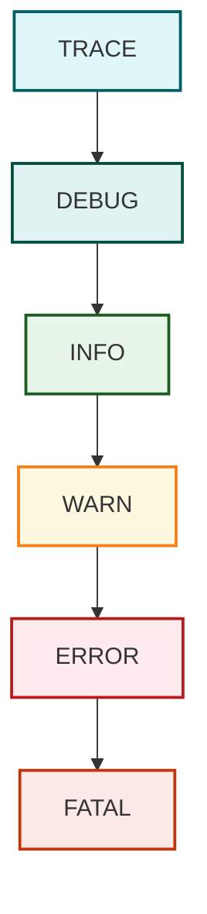

# Introducción a los Logs y la Depuración

## ¿Qué son los logs?
Los logs son registros de eventos que ocurren durante la ejecución de una aplicación. Estos registros permiten a los desarrolladores y administradores monitorear el comportamiento del sistema, detectar errores y entender la secuencia de eventos.

## Importancia del logging en el desarrollo y mantenimiento de aplicaciones
El logging es fundamental para:
- Diagnosticar errores sin necesidad de depuración interactiva.
- Analizar el comportamiento de la aplicación en producción.
- Auditar eventos importantes de negocio o seguridad.
- Mejorar la trazabilidad y mantenibilidad del código.

## Beneficios de usar logs
- **Monitoreo en tiempo real** de la aplicación.
- **Depuración más eficiente** al tener trazas claras.
- **Historial de eventos** para análisis post mortem.
- **Facilidad para cumplir con regulaciones** que exigen auditoría.

## Herramientas de Logging en Java

| Herramienta         | Pros                                          | Contras                                       |
|---------------------|-----------------------------------------------|-----------------------------------------------|
| java.util.logging   | Integrado en JDK                              | Menos flexible y potente que alternativas     |
| Log4j               | Muy configurable, gran comunidad               | Vulnerabilidades en versiones antiguas       |
| Logback             | Basado en Log4j, compatible con SLF4J         | Más complejo para principiantes               |
| SLF4J               | API de fachada, permite cambiar backend       | Necesita backend (Log4j, Logback, etc.)       |
| tinylog             | Muy ligero, ideal para microservicios         | Menos soporte y características avanzadas     |

---
## 📌 ¿Qué es Log4j?

Log4j (Logging for Java) es una librería desarrollada por Apache Foundation que permite registrar mensajes de log en aplicaciones Java.
Su objetivo es **controlar qué información se registra, dónde se guarda, y en qué formato**, de forma **configurable y flexible**.

👉 Se usa para **auditoría, depuración y monitoreo** de aplicaciones en lugar de `System.out.println()`.

---
## 📌 Versiones principales

* **Log4j 1.x** (ya descontinuado, inseguro 🚨).
* **Log4j 2.x** (la versión actual, mucho más potente y recomendada).

⚠️ Importante: En 2021 Log4j fue famoso por la vulnerabilidad **Log4Shell**, por eso **usa siempre la versión más reciente** de Log4j 2.x.

---

## 📌 Conceptos clave en Log4j

Log4j maneja tres componentes principales:

1. **Logger**

   * Es la instancia que tu código usa para escribir mensajes.
   * Ejemplo: `logger.info("mensaje")`.

2. **Appender**

   * Define **dónde** se almacenan los logs.
   * Ejemplo: en consola, archivo, base de datos, etc.

3. **Layout / Pattern**

   * Define el **formato** de salida del log.
   * Ejemplo: `[2025-09-10 20:00:00] INFO com.miapp.Main - Mensaje`.

---

## Implementacion de la Dependencia de Log4j para Maven y Gradle

### Maven

```xml
<dependencies>
    <dependency>
        <groupId>org.apache.logging.log4j</groupId>
        <artifactId>log4j-core</artifactId>
        <version>2.20.0</version>
    </dependency>
    <dependency>
        <groupId>org.apache.logging.log4j</groupId>
        <artifactId>log4j-api</artifactId>
        <version>2.20.0</version>
    </dependency>
</dependencies>
```

### Gradle

```groovy
dependencies {
    implementation 'org.apache.logging.log4j:log4j-core:2.20.0'
    implementation 'org.apache.logging.log4j:log4j-api:2.20.0'
}
```

## Niveles de log y manejo de mensajes
Log4j y otras bibliotecas definen varios niveles de logging, por orden de severidad:

- `TRACE`: Detalles muy finos, usados para diagnosticar problemas, nivel más detallado (flujo paso a paso)..
- `DEBUG`: Información útil para depuración.
- `INFO`: Eventos normales del sistema.
- `WARN`: Algo inesperado, pero la aplicación sigue funcionando.
- `ERROR`: Error que no detiene la aplicación.
- `FATAL`: Error crítico que probablemente detenga la aplicación.
- `OFF`: Desactiva logs.

## Jerarquía de niveles de log en Log4j

Los niveles de log siguen una jerarquía de menor a mayor severidad. Si configuras tu logger en un cierto nivel, **registrará ese nivel y todos los más severos**, pero ignorará los de menor nivel.


Por ejemplo, si configuras el nivel en `INFO`, se registrarán mensajes `INFO`, `WARN`, `ERROR` y `FATAL`, pero no `DEBUG` ni `TRACE`.


## 📌 Configuración de Log4j

La configuración se hace en un archivo `log4j2.xml` (también puede ser JSON o properties).

Ejemplo básico `log4j2.xml`:

```xml
<?xml version="1.0" encoding="UTF-8"?>
<Configuration status="WARN">
    <Appenders>
        <!-- Log a consola -->
        <Console name="Console" target="SYSTEM_OUT">
            <PatternLayout pattern="[%d{yyyy-MM-dd HH:mm:ss}] [%p] %c - %m%n"/>
        </Console>

        <!-- Log a archivo -->
        <File name="FileLogger" fileName="logs/app.log">
            <PatternLayout pattern="[%d{yyyy-MM-dd HH:mm:ss}] [%p] %c - %m%n"/>
        </File>
    </Appenders>

    <Loggers>
        <!-- Logger de tu aplicación -->
        <Logger name="com.miapp" level="debug" additivity="false">
            <AppenderRef ref="Console"/>
            <AppenderRef ref="FileLogger"/>
        </Logger>

        <!-- Logger raíz -->
        <Root level="info">
            <AppenderRef ref="Console"/>
        </Root>
    </Loggers>
</Configuration>
```

👉 Con esto, todos los logs de `com.miapp` van tanto a consola como a archivo.

# Explicación detallada

### `<Configuration status="WARN">`

* **Elemento raíz de la configuración de Log4j2.**
* **`status="WARN"`** controla el **nivel de mensajes internos de Log4j** que se muestran mientras carga/valida la configuración (sirve para debugging de la configuración).

  * Valores típicos: `OFF`, `FATAL`, `ERROR`, `WARN`, `INFO`, `DEBUG`, `TRACE`.
  * Si pones `status="DEBUG"` verás mensajes internos muy verbosos (útil si Log4j no carga como esperas). `WARN` mostrará sólo advertencias internas.
* (Opcionalmente se pueden añadir atributos como `monitorInterval="30"` para recargar el archivo automáticamente cada 30s, o `packages` para detectar plugins, pero no están en tu config.)

---

### `<Appenders> ... </Appenders>`

* **Agrupa todos los appenders** (destinos donde van a escribirse los logs).
* Un *appender* es “dónde” se escribe el log: consola, archivo, BD, socket, etc.

---

#### `<Console name="Console" target="SYSTEM_OUT">`

* **Appender que escribe en la consola.**
* **`name="Console"`**: identificador único del appender. Se usa luego en `<AppenderRef ref="..."/>`.
* **`target="SYSTEM_OUT"`**: destino dentro del proceso Java.

  * `SYSTEM_OUT` → `System.out` (stdout).
  * `SYSTEM_ERR` → `System.err` (stderr).
* Dentro del appender está el `PatternLayout` que define el formato de la línea.

---

#### `<File name="FileLogger" fileName="logs/app.log">`

* **Appender que escribe a un archivo.**
* **`name="FileLogger"`**: identificador único (referenciado por AppenderRef).
* **`fileName="logs/app.log"`**: ruta del archivo donde se escribirán los logs.

  * Si es **ruta relativa**, es relativa al **directorio de trabajo de la JVM** (usualmente `user.dir`).
  * Buenas prácticas: usar rutas absolutas o asegurarse de que la carpeta exista y los permisos sean correctos.
  * **Nota práctica:** Log4j intenta crear el archivo; si la carpeta no existe o no hay permisos, fallará al escribir.
* El `File` appender tiene más atributos útiles (no presentes aquí) como:

  * `append="true|false"` (por defecto suele ser `true` — es decir, agrega al archivo en lugar de sobrescribir),
  * `immediateFlush="true|false"`,
  * buffering, locking, etc. (útiles para rendimiento y concurrencia).

---

### `<PatternLayout pattern="..."/>`

* **Layout** que formatea cada línea de log. El atributo `pattern` usa **placeholders** (convertidores) para incluir fecha, nivel, logger, mensaje, etc.
* Tu patrón: `[%d{yyyy-MM-dd HH:mm:ss}] [%p] %c - %m%n`

Desglosemos cada token:

* **`%d{yyyy-MM-dd HH:mm:ss}`**

  * Fecha y hora del evento; el formato entre `{}` sigue las reglas de `java.time` (p. ej. `yyyy` año, `MM` mes, `dd` día, `HH` hora 24h, `mm` minutos, `ss` segundos).
  * Puedes usar formatos predefinidos (`ISO8601`, `ABSOLUTE`, etc.) o incluir zona horaria: `%d{yyyy-MM-dd HH:mm:ss,SSS}{UTC}`.
* **`%p`**

  * Nivel (priority): `TRACE`, `DEBUG`, `INFO`, `WARN`, `ERROR`, `FATAL`.
  * Alias: `%level`.
* **`%c`**

  * Nombre del *logger* (normalmente el FQCN de la clase que invocó: `com.miapp.servicio.MiClase`).
  * Puedes acortar: `%c{1}` muestra sólo el último segmento (`MiClase`).
* **`%m`**

  * El **mensaje de log** (el texto pasado al logger). Soporta *parameterized messages* con `{}` (ej. `logger.info("Usuario {} entró", nombre)`).
* **`%n`**

  * Nueva línea (equivalente a `System.lineSeparator()`), para terminar la línea.

Otros tokens útiles (no en tu patrón, pero conviene saberlos):

* `%t` → nombre del thread.
* `%C` → clase completa (costoso, usar con cuidado).
* `%F` → nombre de archivo (costoso).
* `%L` → número de línea (costoso).
* `%throwable` / `%ex` → stack trace de una excepción.
* `%marker`, `%X{clave}` (Mapped Diagnostic Context – MDC) → útil para correlación.

---

### `<Loggers> ... </Loggers>`

* Agrupa las definiciones de *loggers* específicos y el *root logger*.

---

#### `<Logger name="com.miapp" level="debug" additivity="false">`

* **Define un logger específico** asociado al nombre `com.miapp` (normalmente el package o clase).
* **`name="com.miapp"`**: puede ser un paquete (p. ej. `com.miapp`) o una clase (`com.miapp.Main`). Afecta a todos los loggers cuyo nombre empiece por ese prefijo.
* **`level="debug"`**: umbral para registrar eventos en este logger:

  * Si `level="debug"`, se registran `DEBUG`, `INFO`, `WARN`, `ERROR`, `FATAL` (y `TRACE` **no** a menos que el nivel sea `TRACE`).
  * El logger sólo permitirá eventos de nivel **>=** al establecido.
* **`additivity="false"`**:

  * *Additivity=true (por defecto)* → los eventos también se propagan hacia los loggers padres (eventualmente el `Root`) y por tanto se escribirían en los appenders de los padres además de los propios.
  * *additivity=false* → **no** se propagan a los padres; se envían **solo** a los appenders referenciados aquí.
  * En tu caso `false` evita duplicar mensajes en appenders del `Root`.
* **Children**: dentro declaras `<AppenderRef ref="Console"/>` y `<AppenderRef ref="FileLogger"/>` → significa que los eventos de `com.miapp` serán enviados a ambos appenders.

---

##### `<AppenderRef ref="Console"/>`

* Hace referencia a un appender declarado en `<Appenders>` por su `name`.
* `ref="Console"` apunta al `<Console name="Console">`.
* Se pueden añadir atributos adicionales (p. ej. filtros) en un `AppenderRef`.

---

#### `<Root level="info">`

* **Logger raíz** (fallback). Todos los loggers sin configuración explícita heredan del `Root`.
* **`level="info"`**: umbral global si un logger no tiene su propio level definido.
* En tu config, el `Root` tiene sólo un `AppenderRef` a `Console`. Eso significa:

  * **Todos** los loggers que no estén definidos explícitamente y que lleguen al root, registrarán eventos `INFO+` y SALDRÁN a consola.
  * Importante: como `com.miapp` tiene `additivity="false"`, los logs de `com.miapp` **no** llegarán al `Root` y por tanto **no** se duplicarán al enviarse también al `Console` del root (aunque en tu caso el `com.miapp` ya tiene su propio `Console`).

---

## 📌 Uso en código

```java
import org.apache.logging.log4j.LogManager;
import org.apache.logging.log4j.Logger;

public class Main {
    private static final Logger logger = LogManager.getLogger(Main.class);

    public static void main(String[] args) {
        logger.trace("Mensaje TRACE");
        logger.debug("Mensaje DEBUG");
        logger.info("Mensaje INFO");
        logger.warn("Mensaje WARN");
        logger.error("Mensaje ERROR");
        logger.fatal("Mensaje FATAL");
    }
}
```

---

## 📌 Tipos de Appenders

Algunos comunes:

* **ConsoleAppender** → salida estándar.
* **FileAppender** → guarda en archivo.
* **RollingFileAppender** → genera archivos rotativos (cuando el log llega a cierto tamaño o fecha).
* **JDBCAppender** → guarda logs en una base de datos.
* **AsyncAppender** → procesa logs en segundo plano (mejora rendimiento).

## Rolling File Appender
En **Log4j**, un **Rolling File Appender** (a veces llamado *RollingFile* o *RollingFileAppender*) es un tipo de **appender** que escribe los logs en un archivo y, cuando ese archivo alcanza un límite definido (por tamaño o por fecha), lo "rota" y crea un nuevo archivo de log.

👉 Esto se hace para evitar que el archivo de logs crezca indefinidamente.

### Características principales:

* 📂 **Rotación por tamaño** → cuando el archivo alcanza, por ejemplo, 10 MB, se renombra como `app.log.1`, y se crea un nuevo `app.log`.
* ⏳ **Rotación por tiempo** → se crea un nuevo archivo según una política de tiempo (por ejemplo, diariamente: `app-2025-09-10.log`).
* ♻️ **Número máximo de archivos** → puedes definir cuántos archivos antiguos se guardan antes de eliminarlos.

### Ejemplo de configuración en `log4j.xml`:

```xml
<?xml version="1.0" encoding="UTF-8"?>
<Configuration status="WARN">
  
  <Appenders>
    <!-- Rolling File Appender -->
    <!-- append = "true" es para que el log no se sobreescriba cada vez que la aplicacion se ejecute-->
    <RollingFile name="ArchivoLog"
                 append = "true"
                 fileName="logs/app.log"
                 filePattern="logs/app-%d{yyyy-MM-dd}-%i.log.gz">

      <!-- Formato del log -->
      <PatternLayout>
        <Pattern>%d [%t] %-5level %c - %msg%n</Pattern>
      </PatternLayout>

      <!-- Política de rotación -->
      <Policies>
        <!-- Rotación diaria -->
        <TimeBasedTriggeringPolicy interval="1" modulate="true"/>
        <!-- Rotación cuando el archivo llega a 10MB -->
        <SizeBasedTriggeringPolicy size="10 MB"/>
      </Policies>

      <!-- Número máximo de logs que se conservan -->
      <DefaultRolloverStrategy max="5"/>
    </RollingFile>
  </Appenders>

  <Loggers>
    <!-- Logger raíz -->
    <Root level="info">
      <AppenderRef ref="ArchivoLog"/>
    </Root>
  </Loggers>

</Configuration>
```

🔎 Explicación rápida:

* `fileName="logs/app.log"` → archivo principal donde se escribe.
* `filePattern="logs/app-%d{yyyy-MM-dd}-%i.log.gz"` → los logs rotados se nombran por fecha e índice y se comprimen en `.gz`.
* `<TimeBasedTriggeringPolicy>` → rota cada día.
* `<SizeBasedTriggeringPolicy size="10 MB"/>` → rota al llegar a 10 MB.
* `<DefaultRolloverStrategy max="5"/>` → guarda un máximo de 5 archivos viejos.
---

## Conbinación del Rolling File Appender con la Asincronia para no bloquear el hilo Principal de nuestra aplicacion
En **Log4j2**, puedes **combinar un RollingFileAppender con asincronía**, no estás limitado solo al `FileAppender`.

---

### 🔹 Cómo funciona

* **RollingFileAppender** → se encarga de escribir y rotar los logs en archivos.
* **AsyncAppender** → envuelve a otros appenders (como RollingFile) y maneja un *buffer* en memoria para que el hilo de tu aplicación **no se bloquee esperando a que se escriba el log en disco**.

Esto es útil porque escribir en archivo puede ser más lento que la ejecución normal de tu aplicación, y con `AsyncAppender` log4j lo hace en un hilo separado.

---

### 🔹 Ejemplo en XML: RollingFile + AsyncAppender

```xml
<?xml version="1.0" encoding="UTF-8"?>
<Configuration status="WARN">

  <Appenders>
    <!-- Rolling File Appender -->
    <RollingFile name="ArchivoLog"
                 append = "true"
                 fileName="logs/app.log"
                 filePattern="logs/app-%d{yyyy-MM-dd}-%i.log.gz">

      <PatternLayout>
        <Pattern>%d [%t] %-5level %c - %msg%n</Pattern>
      </PatternLayout>

      <Policies>
        <SizeBasedTriggeringPolicy size="10 MB"/>
      </Policies>

      <DefaultRolloverStrategy max="5"/>
    </RollingFile>

    <!-- Async Appender que envuelve el RollingFile -->
    <Async name="AsyncLog">
      <AppenderRef ref="ArchivoLog"/>
    </Async>
  </Appenders>

  <Loggers>
    <Root level="info">
      <!-- Enlazamos el async -->
      <AppenderRef ref="AsyncLog"/>
    </Root>
  </Loggers>

</Configuration>
```

---

### 🔹 Lo que pasa en este setup:

1. Tu aplicación escribe en el **AsyncAppender**.
2. El **AsyncAppender** mete el log en un *buffer en memoria*.
3. Un hilo aparte lo envía al **RollingFileAppender** (que hace la rotación por tamaño o tiempo).

Así ganas **mejor rendimiento**, sobre todo en aplicaciones con mucho tráfico de logs.

---

En la mayoría de los casos **sí, es más recomendable usar `AsyncAppender` combinado con `RollingFileAppender`** 👍

### ✅ Ventajas de usar **Async + RollingFile**

1. **Mejor rendimiento** → tu aplicación no se bloquea esperando a que se escriba en disco (la E/S es lenta comparada con la CPU).
2. **Escalabilidad** → si tu app genera muchos logs por segundo, los maneja en memoria y luego los escribe en segundo plano.
3. **Rotación automática** → gracias a `RollingFileAppender` no te preocupas porque el archivo crezca sin control.
4. **Compresión y orden** → los archivos viejos pueden guardarse comprimidos (`.gz`) y organizados por fecha/tamaño.

---

### ⚠️ Cosas a tener en cuenta

* El `AsyncAppender` guarda logs en un **buffer en memoria**. Si tu aplicación se cae de forma abrupta (sin shutdown ordenado), puedes perder los últimos mensajes que no alcanzaron a escribirse.
* Puedes controlar ese riesgo con:

  * `blocking="true"` (para que no pierda logs si el buffer está lleno, aunque pueda frenar un poco).
  * `bufferSize` (ajustar el tamaño de la cola según tus necesidades).
* Si tus logs son **críticos (auditoría, trazabilidad bancaria, etc.)**, quizá prefieras sacrificar algo de rendimiento y escribir sin Async.

---

### 🔹 Recomendación práctica

* Para **aplicaciones de negocio comunes, APIs, microservicios, web apps** → ✅ usa `AsyncAppender + RollingFileAppender`.
* Para **sistemas de misión crítica que no pueden perder ni un log** → usa `RollingFileAppender` directo, o ajusta bien los parámetros del Async.

---

👉 ¿Quieres que te arme un ejemplo de configuración con `AsyncAppender` **optimizado con parámetros de seguridad** (para que casi no pierdas logs incluso si la app se cae)?

## 📌 Buenas prácticas

✅ Usa `logger.debug()` en lugar de `System.out.println()`.
✅ Configura los logs vía archivo, no en código (más flexible).
✅ Usa `RollingFileAppender` para evitar archivos gigantes.
✅ Nunca loguees información sensible (contraseñas, tokens).
✅ Cambia el nivel de logs según el entorno (ej: `DEBUG` en desarrollo, `INFO/WARN` en producción).

---

# Ejemplo realista de la implementacion de logs con Log4j 2

* Configuración en **XML**.
* **RollingFileAppender** (rotación por tamaño + tiempo).
* **AsyncAppender** (asincronía → mejora rendimiento).
* Ejemplo de uso en una aplicación simulada (servicio de login + acceso a base de datos).

---

## 📌 1. Configuración `log4j2.xml`

Este archivo lo pondrías en `src/main/resources/log4j2.xml`.

```xml
<?xml version="1.0" encoding="UTF-8"?>
<Configuration status="WARN" monitorInterval="30">

    <!-- Variables reutilizables -->
    <Properties>
        <!-- Carpeta base para logs -->
        <Property name="LOG_DIR">logs</Property>
    </Properties>

    <Appenders>
        <!-- Log a consola -->
        <Console name="Console" target="SYSTEM_OUT">
            <PatternLayout pattern="[%d{yyyy-MM-dd HH:mm:ss}] [%t] %-5level %c{1} - %msg%n"/>
        </Console>

        <!-- Rolling File: rota por tamaño (10MB) y cada día -->
        <RollingFile name="FileLogger"
                     append = "true"
                     fileName="${LOG_DIR}/app.log"
                     filePattern="${LOG_DIR}/app-%d{yyyy-MM-dd}-%i.log.gz">

            <PatternLayout>
                <Pattern>[%d{yyyy-MM-dd HH:mm:ss}] [%t] %-5level %logger{36} - %msg%n</Pattern>
            </PatternLayout>

            <Policies>
                <SizeBasedTriggeringPolicy size="10 MB"/>
                <TimeBasedTriggeringPolicy/>
            </Policies>
        </RollingFile>

        <!-- Async Appender: hace asincrónico el acceso a FileLogger -->
        <Async name="AsyncFile">
            <AppenderRef ref="FileLogger"/>
        </Async>
    </Appenders>

    <Loggers>
        <!-- Logger específico para la aplicación -->
        <Logger name="com.miapp" level="debug" additivity="false">
            <AppenderRef ref="Console"/>
            <AppenderRef ref="AsyncFile"/>
        </Logger>

        <!-- Logger raíz -->
        <Root level="info">
            <AppenderRef ref="Console"/>
        </Root>
    </Loggers>
</Configuration>
```

---

### 📌 Explicación de lo importante:

* **`<Properties>`** → define variables (`LOG_DIR`) para no repetir rutas.
* **`<RollingFile>`** → escribe en `app.log` y rota a `app-2025-09-10-1.log.gz`, etc.
* **`<Async>`** → encapsula al `FileLogger`, así que los logs a archivo se escriben en **segundo plano**, sin bloquear el hilo principal.
* **Logger `com.miapp`** → nivel `debug`, escribe en **consola** y en el **archivo asincrónico**.
* **Root logger** → nivel `info`, sólo manda a consola (cubre librerías externas).

---

## 📌 2. Código Java de ejemplo realista

Supongamos que tenemos una aplicación con un servicio de login y un servicio de base de datos.

### `Main.java`

```java
package com.miapp;

import org.apache.logging.log4j.LogManager;
import org.apache.logging.log4j.Logger;

public class Main {
    private static final Logger logger = LogManager.getLogger(Main.class);

    public static void main(String[] args) {
        logger.info("Aplicación iniciada");

        AuthService authService = new AuthService();
        DatabaseService dbService = new DatabaseService();

        try {
            boolean loginExitoso = authService.login("admin", "1234");
            if (loginExitoso) {
                dbService.consultarDatos("SELECT * FROM usuarios");
            } else {
                logger.warn("Intento de login fallido");
            }
        } catch (Exception e) {
            logger.error("Error inesperado en la aplicación: {}", e.getMessage(), e);
        }

        logger.info("Aplicación finalizada");
    }
}
```

---

### `AuthService.java`

```java
package com.miapp;

import org.apache.logging.log4j.LogManager;
import org.apache.logging.log4j.Logger;

public class AuthService {
    private static final Logger logger = LogManager.getLogger(AuthService.class);

    public boolean login(String usuario, String clave) {
        logger.debug("Validando credenciales para usuario: {}", usuario);

        if ("admin".equals(usuario) && "1234".equals(clave)) {
            logger.info("Usuario {} autenticado correctamente", usuario);
            return true;
        } else {
            logger.warn("Credenciales inválidas para usuario: {}", usuario);
            return false;
        }
    }
}
```

---

### `DatabaseService.java`

```java
package com.miapp;

import org.apache.logging.log4j.LogManager;
import org.apache.logging.log4j.Logger;

public class DatabaseService {
    private static final Logger logger = LogManager.getLogger(DatabaseService.class);

    public void consultarDatos(String query) {
        logger.debug("Ejecutando query: {}", query);

        try {
            // Simulamos la consulta
            Thread.sleep(200);
            logger.info("Consulta ejecutada con éxito: {}", query);
        } catch (InterruptedException e) {
            logger.error("Error en consulta: {}", e.getMessage(), e);
        }
    }
}
```

---

## 📌 3. Ejemplo de salida de logs

En **consola** verías algo así:

```
[2025-09-10 21:10:15] [main] INFO  Main - Aplicación iniciada
[2025-09-10 21:10:15] [main] INFO  AuthService - Usuario admin autenticado correctamente
[2025-09-10 21:10:15] [main] INFO  DatabaseService - Consulta ejecutada con éxito: SELECT * FROM usuarios
[2025-09-10 21:10:15] [main] INFO  Main - Aplicación finalizada
```

Y en **archivo `logs/app.log`**:

```
[2025-09-10 21:10:15] [main] INFO  com.miapp.Main - Aplicación iniciada
[2025-09-10 21:10:15] [main] DEBUG com.miapp.AuthService - Validando credenciales para usuario: admin
[2025-09-10 21:10:15] [main] INFO  com.miapp.AuthService - Usuario admin autenticado correctamente
[2025-09-10 21:10:15] [main] DEBUG com.miapp.DatabaseService - Ejecutando query: SELECT * FROM usuarios
[2025-09-10 21:10:15] [main] INFO  com.miapp.DatabaseService - Consulta ejecutada con éxito: SELECT * FROM usuarios
[2025-09-10 21:10:15] [main] INFO  com.miapp.Main - Aplicación finalizada
```

---

## 📌 4. Beneficios de esta configuracion

✅ **Consola** para debugging en tiempo real.
✅ **Archivo rotativo** para guardar histórico sin llenar disco.
✅ **Asincronía** para no afectar rendimiento de la aplicación.
✅ Diferentes **niveles** (DEBUG para tu código, INFO/WARN para externos).

---

