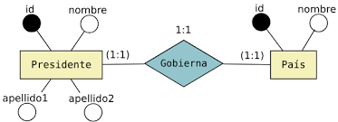
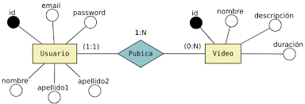
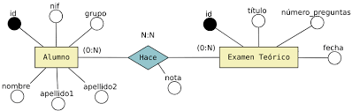

# Diseño de Bases de Datos Relaciones Con PostgreSQL

## Cliclo de Vida del Diseño de Bases de Datos

### 1. Planificación de la Base de Datos

Antes de tocar cualquier software, se define el **propósito** del sistema. En esta etapa se establecen los objetivos, el alcance y los recursos necesarios. Se decide qué funciones debe cumplir la base de datos y quiénes serán los usuarios finales.

### 2. Definición del Sistema

Se especifican el ámbito y los límites de la aplicación de la base de datos. Se identifican los flujos de trabajo, las interfaces de usuario y las aplicaciones que interactuarán con los datos.

### 3. Recolección y Análisis de Requisitos

Es la fase más crítica. Aquí se entrevista a los interesados (stakeholders) para entender qué datos necesitan almacenar y cómo planean usarlos.

* **Documentación de requisitos:** Se crean listas de entidades, atributos y reglas de negocio (ej. "Un cliente solo puede tener un plan de suscripción activo").

### 4. Diseño de la Base de Datos

Esta fase se divide en tres niveles de abstracción:

#### A. Diseño Conceptual

Se crea un esquema independiente de cualquier software o hardware. El objetivo es representar la estructura lógica de los datos de forma visual. Se utiliza comúnmente el **Diagrama Entidad-Relación (DER)**.

#### B. Diseño Lógico

Aquí se transforma el modelo conceptual en un modelo de datos que pueda entender un sistema específico (normalmente el **Modelo Relacional**).

* Se definen las tablas, las llaves primarias (PK) y las llaves foráneas (FK).
* Se aplica la **Normalización** para eliminar redundancias y evitar anomalías en los datos.

#### C. Diseño Físico

Se adapta el diseño lógico a un Sistema Gestor de Bases de Datos (DBMS) específico (como PostgreSQL, MySQL o Oracle). Se deciden:

* Estructuras de almacenamiento y métodos de acceso (índices).
* Integridad de datos y medidas de seguridad.

---

### 5. Mantenimiento Operativo

Una vez que el sistema está en producción, el ciclo no termina. El mantenimiento incluye:

* **Monitoreo del rendimiento:** Ajustar índices si las consultas se vuelven lentas.
* **Actualizaciones:** Modificar la estructura si el negocio cambia.
* **Respaldos:** Garantizar que los datos estén seguros frente a fallos.

---

# Modelo Entidad Relacion **(ER)**

El **Modelo Entidad-Relación (MER)** es una herramienta gráfica que se utiliza para representar la estructura lógica de una base de datos. Fue introducido por Peter Chen en 1976 y sirve como el "plano arquitectónico" antes de construir la base de datos en un software específico.

Su objetivo es describir qué datos se deben almacenar y cómo se relacionan entre sí, utilizando un lenguaje visual que tanto programadores como clientes puedan entender.

## Componentes clave del diagrama ER


* **Rectángulos**: Representan las entidades.
* **Elipses**: Representan los atributos.
* **Rombos**: Representan las relaciones.
* **Líneas**: Conectan las entidades con sus relaciones o atributos.

## Entidades

Una entidad es la representación de un objeto, concepto o evento del mundo real que es relevante para el sistema y del cual se desea guardar información.
Piensa en una entidad como un "sustantivo": una persona, un lugar, un objeto físico o incluso un concepto abstracto.

---

### 1. Características principales

Para que algo sea considerado una entidad en una base de datos, debe cumplir con lo siguiente:

* **Identificable:** Debe poder distinguirse de otros objetos (por ejemplo, a través de un ID o DNI).
* **Atributos:** Posee características que la describen (un "Usuario" tiene nombre, correo y contraseña).
* **Importancia:** Debe ser necesaria para el modelo de negocio que se está construyendo.

### 2. Tipos de Entidades

No todas las entidades son iguales. Se clasifican principalmente en dos:

* **Entidades Fuertes:** Son aquellas que tienen existencia propia y no dependen de otra entidad para existir.
* *Ejemplo:* **Cliente**. Un cliente existe por sí mismo en el sistema.


* **Entidades Débiles:** Son aquellas cuya existencia depende de una entidad fuerte. Si la entidad fuerte desaparece, la débil no tiene sentido.
* *Ejemplo:* **Dependiente**. Si un empleado renuncia y es borrado del sistema, la información de sus familiares (dependientes) ya no tiene razón de estar ahí.

---

### 3. Ejemplos comunes

* **Objetos físicos:** Vehículo, Producto, Empleado, Edificio.
* **Conceptos abstractos:** Proyecto, Cuenta Bancaria, Asignatura.
* **Eventos:** Venta, Reserva, Inscripción.


### 4. Como se grafica en el modelo relacional

En el modelo Entidad-Relación (E-R), la representación gráfica es fundamental para entender la estructura de los datos. Para dibujar estas entidades y sus componentes, se utiliza una notación estándar (generalmente la de Peter Chen o la de "pata de gallo").

La entidad es el concepto principal y se dibuja de la siguiente manera:

* **Rectángulo:** Representa una Entidad Fuerte. Es un objeto que existe por sí mismo (ej. Cliente, Empleado).

* **Rectángulo Doble:** Representa una Entidad Débil. Es aquella que no puede identificarse por sus propios atributos y depende de una entidad fuerte para existir (ej. Dependiente de un empleado o Ejemplar de un libro).


## Atributos

Los **atributos** son las características, propiedades o cualidades que describen a una entidad. Si la entidad es el **"objeto"** (por ejemplo, un Vehículo), los atributos son los datos específicos que queremos saber de él (como la Placa, el Modelo y el Color).

En la implementación práctica, cuando una entidad se convierte en una **tabla**, los atributos se convierten en las **columnas**.

---

### Tipos de Atributos

No todos los atributos cumplen la misma función. Se clasifican según su naturaleza y jerarquía:

#### 1. Atributo Identificador (Llave Primaria)

Es el atributo más importante. Su valor debe ser **único** para cada instancia de la entidad y no puede ser nulo. Permite distinguir un registro de otro.

* *Ejemplo:* El número de **DNI** en una entidad *Persona* o el **ISBN** en un *Libro*.

#### 2. Atributos Simples y Compuestos

* **Simples (Atómicos):** No se pueden dividir en partes más pequeñas con significado propio. Ejemplo: *Precio*.
* **Compuestos:** Se pueden dividir en sub-componentes. Ejemplo: El atributo *Dirección* que se divide en calle, ciudad y código postal.

#### 3. Atributos Monovalorados y Multivalorados

* **Monovalorados:** Solo pueden tener un valor para una entidad específica. Ejemplo: *Fecha de nacimiento*.
* **Multivalorados:** Pueden tener varios valores simultáneos. Ejemplo: El atributo *Títulos universitarios* de un profesor o sus *Teléfonos*.

#### 4. Atributos Derivados

Son aquellos cuyo valor se puede obtener a partir de otros atributos ya existentes, por lo que no siempre es necesario almacenarlos físicamente.

* *Ejemplo:* La *Edad* es un atributo derivado si ya tenemos la *Fecha de Nacimiento*.

---

### Propiedades de los Atributos

Para que un atributo esté bien definido, debe tener:

* **Nombre:** Un identificador claro (ej. `nombre_usuario`).
* **Dominio:** Es el conjunto de valores válidos que puede tomar (ej. el dominio de "Edad" son números enteros positivos).
* **Tipo de dato:** Define si es texto, número, fecha, booleano, etc.

### Los atributos compuestos y multivalorados solo hacerlos en el diseño logico

Esta es una excelente pregunta de diseño. La respuesta corta es: Son muy útiles en la etapa de diseño (Modelo Entidad-Relación), pero no se deben implementar directamente en las tablas (Modelo Relacional), estos atributos deben ser replanteados y transformados en la normalizacion.

---

## Relaciones

Las **relaciones** son los vínculos que permiten conectar dos o más entidades, indicando cómo interactúan entre sí. La **cardinalidad** es la forma en que definimos cuántas instancias de una entidad pueden asociarse con cuántas instancias de otra.

---

### 1. Relación Uno a Uno ()

En este tipo de relación, una instancia de la entidad **A** se relaciona exclusivamente con una instancia de la entidad **B**, y viceversa.

* **Significado:** Es una relación de exclusividad total.
* **Ejemplo:** **Facultad** y **Decano**. Una Facultad solo puede tener un Decano, y un Decano solo puede dirijir a una sola Facultad.
* **Representación:** Se coloca un "1" en ambos extremos de la línea que une a las entidades con el rombo de relación.

<div align="center">
  
</div>
---

### 2. Relación Uno a Muchos ()

Es el tipo de relación más común. Una instancia de la entidad **A** puede relacionarse con varias instancias de la entidad **B**, pero una instancia de **B** solo puede pertenecer a una de **A**.

* **Significado:** Es una relación de jerarquía o pertenencia.
* **Ejemplo:** **Cliente** y **Pedido**. Un cliente puede realizar muchos pedidos a lo largo del tiempo, pero cada pedido individual pertenece a un único cliente.
* **Representación:** Se coloca un "1" del lado de la entidad fuerte (Cliente) y una "N" (o el símbolo de pata de gallo) del lado de la entidad que recibe los registros (Pedido).

<div align="center">
  
</div>

---

### 3. Relación Muchos a Muchos ()

En este caso, múltiples instancias de la entidad **A** pueden relacionarse con múltiples instancias de la entidad **B**.

* **Significado:** Es una relación de asociación libre y múltiple en ambas direcciones.
* **Ejemplo:** **Estudiante** y **Curso**. Un estudiante puede estar inscrito en muchos cursos, y un curso puede tener muchos estudiantes inscritos.
* **Representación:** Se coloca una "N" en un extremo y una "M" en el otro.
* **Nota importante:** En las bases de datos reales (SQL), esta relación no se puede implementar directamente; se debe crear una **tabla intermedia** que rompa la relación en dos relaciones .

Se utilizan letras diferentes (**N** y **M**) simplemente para indicar que la cantidad de elementos en un lado de la relación **no tiene por qué ser igual** a la cantidad de elementos en el otro.

Si usáramos , matemáticamente podrías interpretar que si hay 10 estudiantes, debe haber exactamente 10 cursos. Al usar , dejamos claro que son **dos variables independientes**:

* **N:** Representa un número genérico para el primer conjunto (ej. 50 Estudiantes).
* **M:** Representa otro número genérico para el segundo conjunto (ej. 10 Cursos).

<div align="center">
  
</div>

---

### Resumen de Cardinalidades

| Tipo | Notación | Significado resumido |
| --- | --- | --- |
| **Uno a Uno** |  | Cada registro de A tiene solo uno en B. |
| **Uno a Muchos** |  | Un registro de A tiene varios en B, pero B solo uno en A. |
| **Muchos a Muchos** |  | Muchos registros de A se mezclan con muchos de B. |

<div align="center">
  
</div>

### ¿Qué significan los números de participación (Mínimos y Máximos)?

A veces verás notaciones como  o . Esto añade más detalle:

* **Mínimo (0 o 1):** Indica si la relación es opcional () o obligatoria (). Por ejemplo, un *Autor* puede existir sin haber escrito un *Libro* aún (mínimo 0).
* **Máximo (1 o N):** Indica el límite superior de la relación.


## Participacion

La **participación** define si la existencia de una entidad depende o no de su relación con otra entidad. En palabras simples: nos dice si es **obligatorio** o **voluntario** que un registro participe en una relación.

Se divide en dos tipos: **Total** y **Parcial**.

---

### 1. Participación Total (Obligatoria)

Ocurre cuando **cada una** de las instancias de una entidad debe estar relacionada obligatoriamente con al menos una instancia de la otra entidad. No puede haber "sueltos".

* **Regla de negocio:** "Todo empleado debe pertenecer a un departamento". Si un empleado no tiene departamento, no puede existir en la base de datos.
* **Representación:** Se dibuja con una **línea doble** que conecta la entidad con el rombo de la relación. En notación de cardinalidad mínima, se representa con un **(1, N)** o **(1, 1)**, donde el "1" indica que al menos debe haber una relación.

---

### 2. Participación Parcial (Opcional)

Ocurre cuando **algunas** instancias de la entidad pueden existir sin necesidad de estar relacionadas con la otra entidad. Es decir, la relación no es obligatoria para todos.

* **Regla de negocio:** "Un empleado *puede* manejar un departamento". No todos los empleados son gerentes; algunos manejan un departamento y otros no. La relación "Maneja" es parcial para los empleados.
* **Representación:** Se dibuja con una **línea sencilla** (una sola línea). En notación de cardinalidad mínima, se representa con un **(0, N)** o **(0, 1)**, donde el "0" indica que la relación es opcional.

---

### Ejemplo Comparativo

Imagina una base de datos de una **Biblioteca**:

| Entidad | Relación | Entidad | Participación | Explicación |
| --- | --- | --- | --- | --- |
| **Libro** | Escrito por | **Autor** | **Total** | Todo libro en la biblioteca debe tener al menos un autor registrado. |
| **Lector** | Tiene | **Préstamo** | **Parcial** | Un lector puede estar registrado en la biblioteca pero no tener ningún libro prestado en este momento. |

### ¿Para qué sirve saber esto?

Saber si la participación es total o parcial es crucial al momento de programar la base de datos (SQL), ya que determina:

1. **Constraints (Restricciones):** Si un campo puede ser `NULL` (parcial) o debe ser `NOT NULL` (total).
2. **Integridad Referencial:** Qué pasa si borras un registro (¿se deben borrar los relacionados en cascada?).

---

# Modelo Relacional

El **Modelo Relacional** es la forma en la que esos diagramas de cuadros y rombos que vimos antes se "aterrizan" a una estructura lógica de datos. Fue propuesto por Edgar F. Codd y se basa en la teoría matemática de conjuntos.

---

## 1. Estructura del Modelo

En este modelo, todos los datos se representan en **relaciones** (que visualmente son tablas).

* **Relación (Tabla):** Es el conjunto de datos organizados.
* **Tupla (Fila/Registro):** Es cada una de las filas de la tabla. Representa un objeto individual (ej. un alumno específico).
* **Atributo (Columna/Campo):** Es cada una de las propiedades de la relación (ej. nombre, edad, correo).
* **Dominio:** Es el conjunto de valores permitidos para un atributo. Por ejemplo, el dominio de "Edad" son números enteros entre 0 y 120.

---

## 2. Tipos de Claves (Keys)

Las claves son los mecanismos que usamos para identificar registros y conectar tablas.

### A. Superclave (La más general)

Una superclave es cualquier atributo o combinación de atributos que garantiza la unicidad de una fila.

* **El detalle:** Puede tener atributos "extra" que no son estrictamente necesarios para la identificación.
* **Ejemplo:** En una tabla de `Usuarios`, la combinación `(DNI + Nombre + Color_Favorito)` es una superclave. ¿Por qué? Porque el DNI ya los hace únicos, así que cualquier combinación que lo incluya también será única.

### B. Clave Candidata (La eficiente)

Es una **superclave mínima**. Es decir, es un conjunto de atributos que identifica de forma única a una fila, pero si le quitas un solo atributo, deja de ser única.

* **El detalle:** Una tabla puede tener varias claves candidatas.
* **Ejemplo:** En la misma tabla de `Usuarios`, el `DNI` por sí solo es una clave candidata. El `Correo_Electronico` también es una clave candidata. Ambas son opciones perfectas para identificar al usuario sin datos de sobra.

### C. Clave Primaria o Primary Key (La elegida)

Es la clave candidata que tú, como diseñador, eliges para ser el identificador oficial de la tabla.

* **Reglas de oro:** 1. Nunca puede ser nula (`NOT NULL`).
2. Nunca puede cambiar en el tiempo (debe ser estable).
3. Solo puede haber **una** por tabla.
* **Tendencia:** Hoy en día se suelen usar **Claves Subrogadas** (como un `ID` numérico autoincremental) en lugar de claves naturales (como el DNI), porque son más rápidas de procesar para el motor de la base de datos.

### D. Clave Alternativa

Son las "perdedoras" del concurso de belleza. Todas aquellas claves candidatas que **no** elegiste como Clave Primaria.

* **Importancia:** Aunque no sean la primaria, se les suele aplicar una restricción de `UNIQUE` en la base de datos para asegurar que no se repitan (por ejemplo, para que no haya dos usuarios con el mismo correo).

---

### E. Clave Foránea o Foreign Key (El puente)

Esta es la clave que permite la **integridad referencial**. Es un atributo en una tabla (Tabla B) que apunta a la Clave Primaria de otra tabla (Tabla A).

* **Función:** Establece una conexión lógica.
* **Ejemplo:** En una tabla de `Pedidos`, tienes una columna `ID_Cliente`. Ese `ID_Cliente` es una **Clave Foránea** que te dice qué cliente de la tabla `Clientes` hizo la compra.

---

### Comparativa de Conceptos

| Tipo de Clave | ¿Es única? | ¿Acepta Nulos? | Propósito |
| --- | --- | --- | --- |
| **Primaria** | Sí | No | Identificador oficial y único. |
| **Candidata** | Sí | No | Aspirante a ser primaria. |
| **Alternativa** | Sí | Sí/No | Garantizar que otros campos no se dupliquen. |
| **Foránea** | No (normalmente) | Sí | Relacionar tablas y mantener consistencia. |

### Claves Compuestas: Un caso especial

A veces, un solo atributo no es suficiente para identificar una fila. Una **Clave Compuesta** es una clave primaria formada por **dos o más columnas**.

* **Ejemplo común:** En una tabla de `Inscripciones`, podrías usar la combinación de `(ID_Estudiante + ID_Curso)` como clave primaria. Un estudiante puede estar en muchos cursos y un curso tiene muchos estudiantes, pero la combinación de *ese* estudiante en *ese* curso es única.

---

## 3. Integridad Referencial

La **Integridad Referencial** es una regla de oro en las bases de datos que garantiza que las relaciones entre las tablas permanezcan consistentes y válidas. Su objetivo es evitar los "datos huérfanos" (información que apunta a algo que no existe).

Se basa en la relación entre una **Clave Primaria (PK)** en una tabla "padre" y una **Clave Foránea (FK)** en una tabla "hija".

---

### A. ¿Cómo funciona?

La regla dicta que para cualquier valor en una clave foránea, debe existir un valor correspondiente en la clave primaria de la tabla a la que hace referencia.

* **Si el valor existe:** La relación es válida.
* **Si el valor es NULL:** La relación es opcional (dependiendo de cómo se defina).
* **Si el valor NO existe:** El sistema de base de datos (DBMS) bloqueará la operación y arrojará un error.

---

### B. ¿Qué evita la Integridad Referencial?

Imagina una base de datos de una tienda con dos tablas: `Clientes` y `Pedidos`.

* **Registros inconsistentes:** Evita que puedas crear un pedido para un `ID_Cliente = 99` si en tu tabla de clientes solo tienes del 1 al 50.
* **Borrado accidental:** Si intentas borrar a un cliente que ya tiene 10 pedidos registrados, la integridad referencial te lo impedirá (a menos que definas una acción específica), porque esos 10 pedidos se quedarían "huérfanos" (¿de quién son esos pedidos si el cliente ya no existe?).
* **Modificación de claves:** Si cambias el ID de un cliente, la integridad referencial asegura que los pedidos asociados también se actualicen o que el cambio se bloquee.

---

### C. Acciones Referenciales (Manteniendo la limpieza)

Cuando intentas borrar o actualizar un registro que tiene datos vinculados en otra tabla, puedes configurar cómo debe reaccionar la base de datos:

1. **CASCADE (En Cascada):** Si borras al cliente, se borran automáticamente todos sus pedidos. Si cambias el ID del cliente, se actualiza automáticamente en los pedidos.
2. **RESTRICT / NO ACTION:** Es el comportamiento por defecto. No te permite borrar al cliente mientras tenga pedidos asociados. Primero tendrías que borrar los pedidos.
3. **SET NULL:** Si borras al cliente, los pedidos se quedan en la base de datos pero el campo `ID_Cliente` se pone en `NULL`.
4. **SET DEFAULT:** Si borras al cliente, el campo `ID_Cliente` en los pedidos toma un valor predefinido (por ejemplo, un "Cliente Genérico").

---

### D. Ejemplo Práctico

| Tabla CLIENTES (Padre) |  | Tabla PEDIDOS (Hija) |
| --- | --- | --- |
| **ID_Cliente (PK)** | <--- Relación ---> | **ID_Pedido** | **ID_Cliente (FK)** |
| 1 |  | 101 | 1 |
| 2 |  | 102 | 1 |
| 3 |  | 103 | **99** (ERROR DE INTEGRIDAD) |

> **Nota:** El pedido 103 fallaría al intentar guardarse porque el cliente 99 no existe en la tabla padre.

---

## 4. Restricciones de Integridad

Las **restricciones de integridad** son un conjunto de reglas que el Sistema de Gestión de Bases de Datos (DBMS) impone para asegurar que los datos sean correctos, consistentes y no se corrompan con el paso del tiempo.

Se dividen principalmente en tres categorías fundamentales:

---

### A. Integridad de Entidad (Entity Integrity)

Esta regla se aplica sobre la **Clave Primaria (Primary Key)** de cada tabla.

* **La regla:** Ningún atributo que forme parte de la clave primaria puede tener un valor nulo (`NULL`). Además, cada valor debe ser único.
* **Por qué existe:** Si permitiéramos que una clave primaria fuera nula, no tendríamos forma de identificar esa fila de manera única, lo que rompería la lógica de "entidad" (un objeto distinguible).

---

### B. Integridad Referencial (Referential Integrity)

Esta regla regula la relación entre dos tablas a través de las **Claves Foráneas (Foreign Keys)**.

* **La regla:** Si una tabla tiene una clave foránea que apunta a otra tabla, el valor de esa clave foránea debe coincidir con un valor existente de la clave primaria en la tabla de origen, o bien ser nulo (si la relación es opcional).
* **Por qué existe:** Evita los "datos huérfanos". Impide que, por ejemplo, asignes un empleado a un departamento que no existe.

---

### C. Integridad de Dominio (Domain Integrity)

Esta restricción se aplica sobre los valores individuales de cada **columna (atributo)**.

* **La regla:** Todos los valores almacenados en una columna deben pertenecer al conjunto de valores permitidos para ese atributo. Incluye:
* **Tipo de dato:** Si la columna es `INT`, no puedes meter texto.
* **Formato:** Por ejemplo, que un correo electrónico tenga una `@`.
* **Rango/Check:** Que el campo "Edad" solo acepte números entre 0 y 120.


* **Por qué existe:** Asegura que los datos tengan sentido semántico y técnico.

---

### D. Restricciones Definidas por el Usuario (Reglas de Negocio)

Aparte de las tres anteriores (que son estructurales), existen reglas específicas según lo que el negocio necesite.

* **Ejemplo:** "El saldo de una cuenta bancaria nunca puede ser menor a cero" o "La fecha de salida de un hotel no puede ser anterior a la de entrada".
* Se suelen implementar mediante `CHECK constraints`, `Triggers` o lógica en la aplicación.

---

### Resumen de Restricciones

| Restricción | ¿Sobre qué actúa? | Regla principal |
| --- | --- | --- |
| **Entidad** | Clave Primaria | No nulos, valores únicos. |
| **Referencial** | Clave Foránea | Debe existir en la tabla padre. |
| **Dominio** | Atributo (Columna) | Valor dentro del rango y tipo correcto. |
| **Unicidad (UNIQUE)** | Atributo Alternativo | No permite valores repetidos (ej. el Email). |

### ¿Qué sucede si se rompe una restricción?

Cuando intentas realizar un `INSERT`, `UPDATE` o `DELETE` que viola alguna de estas reglas, el motor de la base de datos **aborta la operación** y devuelve un error, protegiendo así la "salud" de la información.

---

### Ejemplo rápido para conectar todo:

Imagina una tabla **ESTUDIANTES**:

1. **Atributos:** `ID_Estudiante`, `DNI`, `Nombre`, `Edad`.
2. **Claves Candidatas:** `ID_Estudiante` y `DNI` (ambos son únicos).
3. **Clave Primaria:** Elegimos `ID_Estudiante`.
4. **Clave Alternativa:** `DNI`.
5. **Restricción de Dominio:** `Edad` debe ser mayor a 0.
6. **Integridad de Entidad:** No puedo crear un estudiante sin `ID_Estudiante`.


# Normalización

La **normalización** es un proceso técnico que consiste en organizar los datos de una base de datos relacional para reducir la **redundancia** (duplicación de datos) y evitar **anomalías** en las operaciones de insertar, actualizar o borrar información.

En términos sencillos: es el arte de "limpiar" las tablas para que cada dato se guarde en un solo lugar.

---

## ¿Por qué normalizar?

Si no normalizas, tu base de datos puede sufrir tres problemas graves:

1. **Redundancia:** Repetir el nombre de un proveedor en 1,000 filas de productos (si el nombre cambia, tendrías que editar 1,000 filas).
2. **Anomalías de actualización:** Si olvidas actualizar una fila, los datos pierden coherencia.
3. **Anomalías de borrado:** Si borras el único producto de un proveedor y la información del proveedor estaba en esa misma fila, pierdes al proveedor también.

---

## Las Formas Normales (FN)

Existen varias reglas llamadas "Formas Normales". Para que una base de datos esté bien diseñada, generalmente se llega hasta la tercera.

### 1. Primera Forma Normal (1FN): Atomicidad

* **Regla:** Cada celda debe contener un solo valor (atómico) y no debe haber grupos repetidos.

La **Primera Forma Normal (1FN)** es el primer paso y el más fundamental en el proceso de normalización. Su objetivo principal es asegurar que la tabla tenga una estructura tabular limpia y que los datos sean **atómicos** (indivisibles).

Para que una tabla cumpla con la **1FN**, debe seguir estas tres reglas estrictas:

1. **Atomicidad:** Cada celda (intersección de fila y columna) debe contener un solo valor. No se permiten listas ni conjuntos de datos en un mismo campo.
2. **Unicidad de Columnas:** No debe haber grupos repetidos de columnas que guarden el mismo tipo de información (ej. Telefono1, Telefono2, Telefono3).
3. **Clave Primaria:** La tabla debe tener una clave primaria que identifique de forma única cada registro.

---

### Ejemplo Práctico: De una tabla "Sucia" a la 1FN

Imagina que tenemos una tabla para registrar los cursos que toman los alumnos en una universidad.

#### Tabla No Normalizada (Incumple la 1FN)

| ID_Alumno | Nombre | Carrera | Cursos |
| --- | --- | --- | --- |
| 10 | Juan Pérez | Sistemas | Matemáticas, Programación |
| 20 | Ana Gómez | Diseño | Ilustración, Fotografía |

> **¿Por qué está mal?** La columna **Cursos** tiene valores múltiples (Matemáticas y Programación están en la misma celda). Esto impide hacer búsquedas eficientes (ej. "¿Cuántos alumnos hay en Programación?") y dificulta el mantenimiento.

---

#### Aplicando la 1FN (Solución)

Para normalizarla, debemos "expandir" la tabla de modo que cada curso tenga su propia fila. La información del alumno se repetirá, pero cada celda será ahora **atómica**.

| ID_Alumno | Nombre | Carrera | Curso |
| --- | --- | --- | --- |
| 10 | Juan Pérez | Sistemas | Matemáticas |
| 10 | Juan Pérez | Sistemas | Programación |
| 20 | Ana Gómez | Diseño | Ilustración |
| 20 | Ana Gómez | Diseño | Fotografía |

---

### ¿Qué ganamos con esto?

* **Búsquedas fáciles:** Ahora puedes ejecutar un comando `SELECT` buscando exactamente "Programación" sin usar trucos de texto complicados.
* **Orden lógico:** Cada fila representa una relación única entre un Alumno y un Curso.
* **Escalabilidad:** Un alumno puede inscribirse en 10 cursos más y simplemente agregamos filas, sin tener que "agrandar" la celda de texto o crear columnas infinitas (`Curso1`, `Curso2`, etc.).

**Dato importante:** Aunque aquí ya cumplimos la **1FN**, notarás que el nombre "Juan Pérez" se repite. Eso es una redundancia que se soluciona en la **Segunda Forma Normal (2FN)** separando los datos del alumno de los datos de la inscripción.

### 2. Segunda Forma Normal (2FN): Dependencia Total

La **Segunda Forma Normal (2FN)** tiene un objetivo principal: eliminar la **redundancia parcial**. Es decir, asegura que cada dato en una tabla dependa de la clave primaria *completa* y no solo de un pedazo de ella.

Para que una tabla esté en **2FN**, debe cumplir con dos requisitos:

1. Ya debe estar en **Primera Forma Normal (1FN)**.
2. **Dependencia Funcional Completa:** Todos los atributos que no son parte de la clave primaria deben depender de la clave primaria completa. (Esto es especialmente relevante en tablas con **claves compuestas**, donde la clave se forma por dos o más columnas).

---

### Ejemplo Práctico: De la 1FN a la 2FN

Continuemos con el ejemplo anterior de los alumnos y sus cursos. Supongamos que tenemos esta tabla que ya está en **1FN** (datos atómicos):

#### Tabla en 1FN (Pero con problemas)

La clave primaria aquí es **compuesta**: `(ID_Alumno + ID_Curso)`.

| ID_Alumno (PK) | ID_Curso (PK) | Nombre_Alumno | Nombre_Curso | Calificación |
| --- | --- | --- | --- | --- |
| 10 | MAT1 | Juan Pérez | Matemáticas | 9.0 |
| 10 | PRG1 | Juan Pérez | Programación | 8.5 |
| 20 | MAT1 | Ana Gómez | Matemáticas | 10.0 |

> **¿Dónde está el error?**
> * El `Nombre_Alumno` depende de `ID_Alumno`, pero **no** le importa el `ID_Curso`. (Dependencia parcial).
> * El `Nombre_Curso` depende de `ID_Curso`, pero **no** le importa el `ID_Alumno`. (Dependencia parcial).
> * Solo la `Calificación` depende de **ambos** (necesitas saber quién es el alumno y qué materia cursó para saber la nota).
> 
> 

---

### Aplicando la 2FN (Solución)

Para normalizar, debemos separar los datos en tres tablas distintas, de modo que cada atributo dependa únicamente de su llave correspondiente:

#### A. Tabla ALUMNOS

| ID_Alumno (PK) | Nombre_Alumno |
| --- | --- |
| 10 | Juan Pérez |
| 20 | Ana Gómez |

#### B. Tabla CURSOS

| ID_Curso (PK) | Nombre_Curso |
| --- | --- |
| MAT1 | Matemáticas |
| PRG1 | Programación |

#### C. Tabla INSCRIPCIONES (La que une a ambas)

| ID_Alumno (FK) | ID_Curso (FK) | Calificación |
| --- | --- | --- |
| 10 | MAT1 | 9.0 |
| 10 | PRG1 | 8.5 |
| 20 | MAT1 | 10.0 |

---

### Beneficios de la 2FN

1. **Ahorro de espacio:** El nombre "Juan Pérez" se escribe una sola vez en la base de datos, sin importar en cuántos cursos esté inscrito.
2. **Consistencia de datos:** Si Juan cambia su nombre, solo lo editas en un registro (Tabla Alumnos). En la tabla de 1FN, tendrías que buscar y editar todas las filas donde apareciera.
3. **Evita anomalías:** Puedes dar de alta un curso nuevo en la tabla `CURSOS` aunque todavía no tenga alumnos inscritos. En la tabla anterior, no podrías registrar el curso sin tener un `ID_Alumno`.

---

### 3. Tercera Forma Normal (3FN): Adiós a las dependencias transitivas

* **Requisito:** Debe estar en 2FN.
* **Regla:** Los atributos no deben depender de otros atributos que tampoco son clave.

La **Tercera Forma Normal (3FN)** es el último paso del proceso estándar de normalización para la mayoría de las aplicaciones comerciales. Su objetivo es eliminar las **dependencias transitivas**.

En palabras sencillas: una tabla está en 3FN si no hay columnas (que no sean claves) que dependan de otras columnas (que tampoco sean claves). **Todo debe depender directamente de la Clave Primaria y de nada más.**

### Requisitos para la 3FN:

1. Debe estar ya en **Segunda Forma Normal (2FN)**.
2. No debe haber **dependencias transitivas**: Un atributo no clave no puede depender de otro atributo no clave.

---

### Ejemplo Práctico: De la 2FN a la 3FN

Imagina que tenemos una tabla de **EMPLEADOS** que ya cumple con la 1FN (datos atómicos) y la 2FN (no hay claves compuestas, así que no hay dependencias parciales).

#### Tabla en 2FN (Con dependencias transitivas)

La clave primaria es `ID_Empleado`.

| ID_Empleado (PK) | Nombre | ID_Departamento | Nombre_Departamento | Ciudad_Oficina |
| --- | --- | --- | --- | --- |
| 101 | Luis Jara | D01 | Contabilidad | Madrid |
| 102 | Marta Rivas | D02 | Tecnología | Barcelona |
| 103 | Pedro Soto | D01 | Contabilidad | Madrid |

> **¿Dónde está el problema?**
> * El `Nombre` depende de `ID_Empleado` (Correcto).
> * El `ID_Departamento` depende de `ID_Empleado` (Correcto).
> * Pero el `Nombre_Departamento` y la `Ciudad_Oficina` dependen en realidad del **ID_Departamento**, no directamente del empleado.
> * Esto es una **dependencia transitiva**: `ID_Empleado` -> `ID_Departamento` -> `Nombre_Departamento`.
> 
> 

---

### Aplicando la 3FN (Solución)

Para normalizar, debemos extraer los atributos que dependen del departamento y ponerlos en su propia tabla.

#### A. Tabla EMPLEADOS

Aquí dejamos solo la información propia del empleado y su vínculo (FK) al departamento.

| ID_Empleado (PK) | Nombre | ID_Departamento (FK) |
| --- | --- | --- |
| 101 | Luis Jara | D01 |
| 102 | Marta Rivas | D02 |
| 103 | Pedro Soto | D01 |

#### B. Tabla DEPARTAMENTOS

Aquí almacenamos los detalles de cada departamento una sola vez.

| ID_Departamento (PK) | Nombre_Departamento | Ciudad_Oficina |
| --- | --- | --- |
| D01 | Contabilidad | Madrid |
| D02 | Tecnología | Barcelona |

---

### ¿Qué logramos con la 3FN?

1. **Eliminar la redundancia:** Ya no escribimos "Contabilidad" y "Madrid" cada vez que contratamos a alguien en ese departamento.
2. **Integridad de datos:** Si el departamento de Contabilidad se muda de Madrid a Sevilla, solo actualizamos **una fila** en la tabla `DEPARTAMENTOS`. Si no estuviéramos en 3FN, tendríamos que buscar a todos los empleados de ese departamento y cambiarles la ciudad uno por uno.
3. **Independencia:** Podemos crear un departamento nuevo (ej. "Marketing" en "Valencia") sin necesidad de tener empleados asignados todavía.

---

## Resumen del proceso

| Forma Normal | Objetivo principal |
| --- | --- |
| **1FN** | Eliminar valores repetidos y celdas con múltiples datos. |
| **2FN** | Eliminar datos que dependen solo de una parte de la clave. |
| **3FN** | Eliminar datos que no dependen directamente de la clave primaria. |

## ¿Es siempre bueno normalizar al máximo?

No siempre. En sistemas muy grandes (como Big Data) o bases de datos de solo lectura (Data Warehousing), a veces se hace lo contrario (**desnormalización**) para ganar velocidad en las consultas, sacrificando el ahorro de espacio. Pero para aplicaciones estándar, la **3FN** es el estándar de oro.


# Aspectos Avanzados de Diseño

## Indices

Los **índices** son estructuras de datos adicionales que se crean sobre las tablas para mejorar la velocidad de recuperación de la información.

Para entenderlo fácilmente, imagina que una tabla de base de datos es un **libro de 1,000 páginas**. Si quieres buscar el tema "Normalización", tienes dos opciones:

1. **Escaneo Secuencial:** Leer hoja por hoja desde la página 1 hasta encontrar el término (Muy lento).
2. **Uso de un Índice:** Ir a las últimas páginas del libro, buscar "Normalización" en orden alfabético y ver que dice "Página 450" (Muy rápido).

---

### ¿Cómo funcionan técnicamente?

A nivel interno, un índice suele ser un **Árbol B+** (B-Tree). Este organiza los valores de la columna indexada de forma jerárquica, permitiendo que el motor de la base de datos encuentre un registro en un número mínimo de pasos, en lugar de revisar cada fila de la tabla.

---

### ¿Para qué sirven al momento de diseñar?

Al diseñar una base de datos, los índices cumplen funciones estratégicas:

#### 1. Optimización de Consultas (SELECT)

Es su uso más común. Los índices reducen drásticamente el tiempo que tarda una consulta en devolver resultados, especialmente en tablas con millones de registros.

#### 2. Agilidad en las Búsquedas y Filtros (WHERE)

Si consultas frecuentemente por el campo `apellido`, crear un índice en esa columna hará que el motor encuentre a los "García" al instante.

#### 3. Mejora en la velocidad de las Uniones (JOIN)

Cuando relacionas dos tablas (por ejemplo, `Pedidos` con `Clientes`), los índices en las **Claves Foráneas (FK)** permiten que el motor "empareje" los registros de forma casi inmediata.

#### 4. Garantía de Unicidad

Los índices únicos (`UNIQUE INDEX`) aseguran que no haya valores duplicados en una columna, como el correo electrónico o el número de pasaporte, ayudando a mantener la **Integridad de los Datos**.

---

### Tipos de Índices comunes

* **Índice Clustered (Agrupado):** Define el orden físico de los datos en el disco. Solo puede haber uno por tabla (normalmente es la Clave Primaria).
* **Índice Non-Clustered (No Agrupado):** Es como el índice del libro; el dato está en un lugar y el índice en otro, apuntando hacia él. Puedes tener muchos por tabla.

---

### El "Costo" de los Índices (Lo que debes cuidar)

Aunque parecen perfectos, tienen desventajas que debes considerar en tu diseño:

* **Ralentizan las escrituras (INSERT, UPDATE, DELETE):** Cada vez que agregas o cambias un dato, el motor también debe actualizar todos los índices asociados.
* **Consumen espacio en disco:** Un índice es una copia organizada de los datos, por lo que aumenta el tamaño de la base de datos.

---

### ¿Cuándo deberías crear un índice?

| Crear índice si... | Evitar índice si... |
| --- | --- |
| La columna se usa frecuentemente en cláusulas `WHERE`. | La tabla es muy pequeña (pocas filas). |
| La columna se usa para unir tablas (`JOIN`). | La columna cambia de valor constantemente. |
| La columna tiene una alta selectividad (muchos valores distintos). | La columna tiene pocos valores (ej: una columna "Género"). |

**Regla de oro del diseño:** Indexa solo lo necesario. Un exceso de índices hará que tu base de datos sea rápida para leer, pero extremadamente lenta para guardar información.

Imaginemos que estamos diseñando la base de datos de una plataforma tipo **E-commerce**.

### El Escenario

Tienes una tabla llamada `Productos` con 1,000,000 de registros. Los usuarios suelen buscar productos por su **nombre** o filtrar por su **categoría**.

Sin un índice, cada vez que alguien busca "iPhone 15", la base de datos tiene que leer el millón de filas para encontrar los resultados. Esto tarda segundos, lo cual es demasiado para una web moderna.

---

### 1. Definición en SQL

Para solucionar esto, creamos índices en las columnas que más se usan en los filtros.

```sql
-- Creamos un índice para acelerar las búsquedas por nombre de producto
CREATE INDEX idx_producto_nombre 
ON Productos (nombre);

-- Creamos un índice para acelerar el filtrado por categoría
CREATE INDEX idx_producto_categoria 
ON Productos (categoria_id);

```

---

### 2. ¿Qué pasa internamente?

Antes del índice, la base de datos hacía un **Table Scan** (leer todo). Con el índice, el motor de la base de datos crea una estructura separada (como un mapa) que tiene el nombre del producto y un puntero (dirección) a la fila real.

| Valor en el Índice (Ordenado) | Puntero a la Fila Física |
| --- | --- |
| Audífonos Sony | Fila #842,901 |
| iPhone 15 | Fila #12,402 |
| Monitor Dell | Fila #503,110 |

---

### 3. Ejemplo de Consulta beneficiada

Cuando ejecutas esta consulta:

```sql
SELECT * FROM Productos 
WHERE nombre = 'iPhone 15';

```

El motor no busca en la tabla. Va al índice `idx_producto_nombre`, encuentra "iPhone 15" en milisegundos y salta directamente a la fila exacta.

---

### 4. Un ejemplo de Índice Único (Restricción + Velocidad)

Si quieres que el código de barras (`SKU`) nunca se repita y además se busque rápido:

```sql
CREATE UNIQUE INDEX idx_producto_sku 
ON Productos (sku);

```

Aquí el índice cumple dos funciones:

1. **Velocidad:** Encuentra el producto por código de barras al instante.
2. **Integridad:** Si intentas insertar un producto con un `SKU` que ya existe, la base de datos dará un error.

---

### ¿Cómo saber si tu índice está funcionando?

En bases de datos como MySQL o PostgreSQL, puedes usar el comando `EXPLAIN`:

```sql
EXPLAIN SELECT * FROM Productos WHERE nombre = 'iPhone 15';

```

Si en la columna `type` o `key` ves el nombre de tu índice, significa que el diseño es correcto y la consulta es eficiente.


## Vistas

Una **vista** en una base de datos es, esencialmente, una **tabla virtual**. No almacena datos físicamente por sí misma; en su lugar, almacena una consulta SQL (una "receta") que se ejecuta cada vez que consultas la vista.

Para el usuario o la aplicación, una vista se ve y se comporta exactamente como una tabla real, pero su contenido se genera dinámicamente a partir de una o varias tablas base.

---

### 1. ¿Para qué sirven las vistas?

Las vistas son herramientas de diseño estratégico que se utilizan principalmente por tres razones:

* **Simplificación:** Permiten ocultar la complejidad de consultas largas. Si tienes un `JOIN` entre 5 tablas con cálculos matemáticos complejos, puedes guardar eso como una vista llamada `resumen_ventas` y consultarla con un simple `SELECT * FROM resumen_ventas`.
* **Seguridad:** Puedes restringir el acceso a datos sensibles. Por ejemplo, puedes crear una vista de la tabla `Empleados` que muestre el nombre y el departamento, pero que **oculte** el salario y la dirección. Luego, le das permiso al usuario para ver la vista, pero no la tabla original.
* **Consistencia:** Si la estructura de las tablas base cambia (por ejemplo, divides una tabla en dos), puedes actualizar la definición de la vista para que las aplicaciones que la usan no se rompan.

---

### 2. Ejemplo real de creación

Imagina que tienes dos tablas: `Clientes` y `Pedidos`. Quieres ver siempre qué clientes han comprado qué productos sin escribir el `JOIN` cada vez.

```sql
CREATE VIEW reporte_pedidos_recientes AS
SELECT 
    c.nombre AS cliente, 
    p.fecha, 
    p.total
FROM Clientes c
JOIN Pedidos p ON c.id_cliente = p.id_cliente
WHERE p.fecha > '2025-01-01';

```

Ahora, cada vez que necesites esa información, solo haces:
`SELECT * FROM reporte_pedidos_recientes;`

---

### 3. Tipos de Vistas

| Tipo | Descripción |
| --- | --- |
| **Vistas Estándar** | La consulta se ejecuta en tiempo real cada vez que la llamas. No ocupa espacio en disco (solo la definición). |
| **Vistas Materializadas** | El resultado de la consulta se guarda físicamente en el disco. Son mucho más rápidas para datos masivos, pero deben "refrescarse" periódicamente para actualizarse. |

---

### 4. Ventajas y Desventajas

**Ventajas:**

* **Modularidad:** Separa la lógica de los datos de la lógica de la aplicación.
* **Legibilidad:** El código SQL de tu aplicación se vuelve mucho más limpio.
* **Personalización:** Diferentes usuarios pueden ver los mismos datos de formas distintas.

**Desventajas:**

* **Rendimiento:** Si una vista estándar se basa en una consulta muy pesada o mal optimizada, cada vez que la uses podrías ralentizar el sistema.
* **Limitaciones de actualización:** Aunque algunas vistas permiten insertar o actualizar datos (`Vistas Actualizables`), la mayoría de las que tienen `JOINs` o funciones de agregado (como `SUM` o `AVG`) son de **solo lectura**.

---

### ¿Cuándo deberías usarlas?

Como regla de diseño, usa vistas siempre que te encuentres escribiendo la misma consulta compleja una y otra vez, o cuando necesites crear una capa de seguridad para que ciertos usuarios no vean columnas prohibidas.


## Transacciones

Una **transacción** en una base de datos es una unidad lógica de trabajo que contiene una o más operaciones SQL (como `INSERT`, `UPDATE` o `DELETE`). Lo especial de una transacción es que se ejecuta bajo la filosofía de **"todo o nada"**.

Si una de las operaciones dentro de la transacción falla, todas las demás se deshacen para que la base de datos no quede en un estado inconsistente o con datos a medias.

---

### 1. Las Propiedades ACID

Para que una transacción sea considerada segura y confiable, debe cumplir con cuatro propiedades fundamentales conocidas por el acrónimo **ACID**:

* **Atomicidad (Atomicity):** La transacción es una unidad indivisible. O se confirman todos los cambios o no se hace ninguno. Si el sistema falla a mitad del proceso, se hace un **Rollback** (marcha atrás).
* **Consistencia (Consistency):** Una transacción debe llevar a la base de datos de un estado válido a otro estado válido, respetando todas las reglas (claves primarias, foráneas, checks).
* **Aislamiento (Isolation):** Las operaciones de una transacción son invisibles para otras transacciones que ocurren simultáneamente hasta que la primera finaliza. Esto evita que alguien lea datos "temporales" que podrían ser cancelados.
* **Durabilidad (Durability):** Una vez que la transacción se ha confirmado (Commit), los cambios son permanentes y sobrevivirán incluso si hay un fallo de energía o el sistema se apaga.

---

### 2. Ejemplo real: Una transferencia bancaria

Este es el ejemplo clásico para entender por qué necesitamos transacciones. Supongamos que quieres transferir **$100** de la `Cuenta A` a la `Cuenta B`.

Esta operación requiere dos pasos:

1. **Restar $100** del saldo de la `Cuenta A`.
2. **Sumar $100** al saldo de la `Cuenta B`.

**¿Qué pasa si el sistema falla justo después del paso 1?**
Sin transacciones, el dinero desaparecería de la Cuenta A y nunca llegaría a la B. El banco perdería $100 de la nada. Gracias a las transacciones, si el paso 2 falla, el paso 1 se deshace automáticamente.

---

### 3. Ciclo de vida de una transacción

En SQL, una transacción se controla mediante tres comandos principales:

1. **BEGIN TRANSACTION:** Indica el inicio del bloque de operaciones.
2. **COMMIT:** Guarda todos los cambios de forma permanente. Se usa cuando todo salió bien.
3. **ROLLBACK:** Deshace todos los cambios realizados desde el `BEGIN`. Se usa si ocurrió un error.

```sql
BEGIN TRANSACTION;

UPDATE Cuentas SET saldo = saldo - 100 WHERE id = 'Cuenta_A';
UPDATE Cuentas SET saldo = saldo + 100 WHERE id = 'Cuenta_B';

-- Si no hubo errores:
COMMIT;

-- Si algo falló:
-- ROLLBACK;

```

---

### 4. Los niveles de aislamiento

A veces, para mejorar el rendimiento, los diseñadores permiten que el aislamiento no sea perfecto. Existen diferentes niveles:

* **Read Uncommitted:** El más rápido pero menos seguro (permite lecturas "sucias").
* **Read Committed:** Solo lee datos que ya han sido confirmados.
* **Repeatable Read:** Garantiza que si lees un dato dos veces en la misma transacción, será el mismo.
* **Serializable:** El nivel más alto; las transacciones se ejecutan como si fueran una tras otra.

---

### ¿Para qué sirven al diseñar?

Al diseñar tu base de datos y tu aplicación, debes identificar qué procesos son críticos. No todo necesita ser una transacción compleja (porque consumen recursos), pero cualquier proceso que involucre múltiples tablas relacionadas o movimientos de valores (como inventarios, pagos o registros de usuarios con perfiles) **debe** estar envuelto en una transacción para garantizar la integridad.


## Escalar una Base de Datos

Escalar una base de datos es el proceso de aumentar la capacidad del sistema para manejar una mayor carga de trabajo (más usuarios, más datos o más consultas por segundo). Es un desafío de diseño que va más allá de simplemente comprar un servidor más grande.

Aquí tienes los aspectos clave que debes considerar:

---

### 1. Escalamiento Vertical vs. Horizontal

Es la primera decisión arquitectónica que debes tomar:

* **Vertical (Scaling Up):** Consiste en añadir más potencia (**CPU, RAM, SSD**) al servidor actual.
* *Ventaja:* Es lo más sencillo; no requiere cambios en el código de la aplicación.
* *Desventaja:* Tiene un límite físico (el hardware más potente del mercado) y es un punto único de fallo.


* **Horizontal (Scaling Out):** Consiste en añadir más servidores y repartir la carga entre ellos.
* *Ventaja:* Crecimiento casi infinito y mayor disponibilidad.
* *Desventaja:* Aumenta la complejidad técnica y requiere lógica para sincronizar datos.


---

### 2. Réplicas de Lectura (Read Replicas)

En la mayoría de las aplicaciones (como redes sociales o blogs), el 90% de las operaciones son de **lectura** (`SELECT`) y solo el 10% son de **escritura**.

* **Estrategia:** Mantienes un servidor "Maestro" para las escrituras y varios servidores "Esclavos" que sincronizan los datos para atender las consultas de lectura. Esto libera la carga del servidor principal.

---

### 3. Sharding (Particionamiento Horizontal)

Cuando una tabla es tan masiva que no cabe o es muy lenta en un solo servidor, se utiliza el **Sharding**.

* **Cómo funciona:** Divides la tabla en trozos más pequeños basados en una "clave de partición" (ej. el ID del usuario).
* **Ejemplo:** Los usuarios con ID del 1 al 1,000,000 van al Servidor A, y del 1,000,001 al 2,000,000 al Servidor B.

---

### 4. Particionamiento de Tablas

A diferencia del sharding, esto ocurre **dentro del mismo servidor**.

* **Partición por Rango:** Puedes dividir una tabla de `Ventas` por año. Al buscar una venta de 2024, el motor ignora los datos de 2020 a 2023, acelerando la consulta drásticamente.

---

### 5. Caché de Datos

No todas las consultas deben llegar a la base de datos. Implementar una capa de caché (como **Redis** o **Memcached**) en memoria RAM permite devolver resultados instantáneos para los datos que se consultan con más frecuencia.

---

### 6. Optimización del Diseño (Antes de escalar hardware)

A veces el problema no es la falta de potencia, sino un mal diseño. Antes de escalar, revisa:

* **Índices:** Asegúrate de que las consultas lentas estén bien indexadas.
* **Consultas N+1:** Evita que tu código haga cientos de consultas pequeñas en lugar de una sola eficiente.
* **Pool de Conexiones:** Gestiona correctamente cuántas conexiones simultáneas puede abrir tu aplicación para no saturar la base de datos.

---

### Resumen de Selección

| Necesidad | Solución Recomendada |
| --- | --- |
| El servidor está al 90% de CPU/RAM. | **Escalado Vertical** (más RAM/CPU). |
| Demasiadas consultas de lectura lentas. | **Réplicas de Lectura** o **Caché**. |
| La tabla tiene miles de millones de filas. | **Sharding** o **Particionamiento**. |
| Alta disponibilidad (que nunca se caiga). | **Clustering / Multi-AZ**. |


